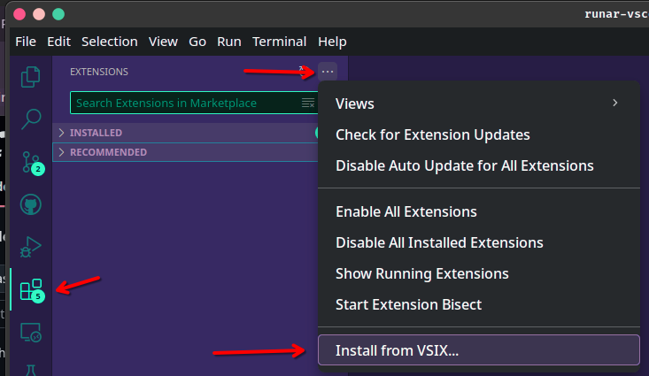

# 🌌 Rúnar Theme
 
A dark VS Code Theme in a **neo-style**.  
Neon-Pink, Neon-Green and Purple enrich syntax highlighting.

## Development

1. Clone or download `runar-themes` repository
2. Open VS Code
3. Press F5 to open development mode

### Packaging and install extension

Once the repository is available you can package the extension with `vsce`. 

Follow these steps: 

1. Install `vsce` tooling
```bash
npm install -g vsce
```
2. Build package
```bash
vsce package
```
3. Install extension

